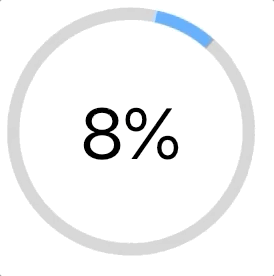

# LoadingWidget React Component

Example spinner loading bar widget in React

</img>

## Getting started

Run `npm install`. Built with node `v12.18.0`

## Running this component yourself

Simply drag and drop the [Spinner Widget Component](./src/components/SpinnerWidget) into you components folder and reference accordingly. Should work automatically

```jsx
<SpinnerWidget value={10} spinning={true} />
```

Properties:

- `value` = what you want the displayed value set to. Needs to be between 0 - 100. Defaults to `0`.
- `spinning` = whether or not to enable the spinning animation. Defaults to `true`

See the below commands about running a demo yourself.

## Running the demo code

Available commands

- `npm start`
  - start the project and to see a Demo
- `npm test`
  - run tests
- `npm run build`
  - Builds the app for production to the `build` folder.<br /> It correctly bundles React in production mode and optimizes the build for the best performance. The build is minified and the filenames include the hashes.<br /> Your app is ready to be deployed! See the section about [deployment](https://facebook.github.io/create-react-app/docs/deployment) for more information.

## Areas to Improve

- Round out the edges of the loading bar
- Make the loading bar smoothly transition between percentage values.
